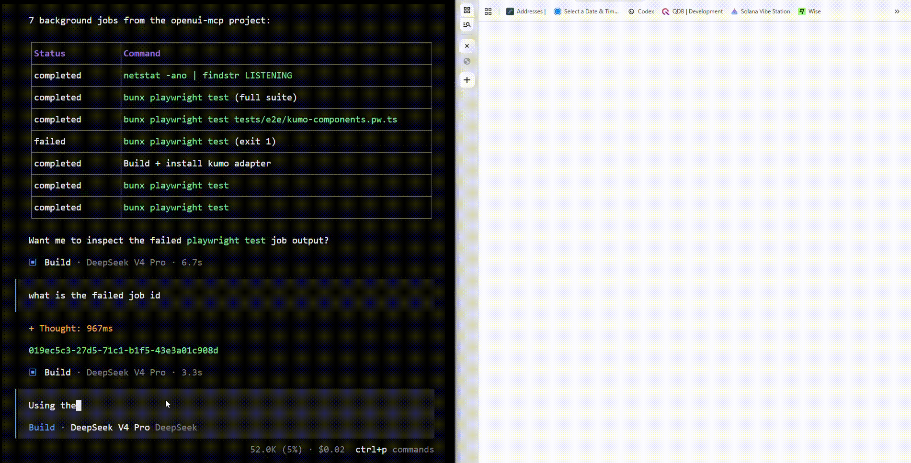
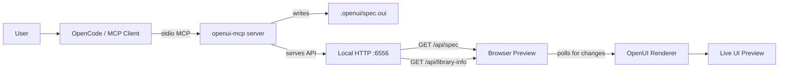

<div align="center">
 <h1>OpenUI MCP</h1>
</div>

<p align="center">
  <a href="https://github.com/naadodimtr/openui-mcp/actions">
    
  </a>
  <a href="https://github.com/naadodimtr/openui-mcp/blob/main/LICENSE">
    
  </a>
</p>

<p align="center">
  <strong>Live   <a href="https://www.openui.com">OpenUI</a>  previews for AI coding agents in seconds.</strong>
</p>

<p align="center">
  Ask an LLM to build UI with a chosen design-system adapter. OpenUI MCP writes the spec. The browser updates live.
</p>

<p align="center">
  <a href="#for-humans">For humans</a> •
  <a href="#kumo-adapter-demo">Kumo demo</a> •
  <a href="#quick-start">Quick start</a> •
  <a href="#for-agents">For agents</a> •
  <a href="#adapters">Adapters</a> •
  <a href="#development">Development</a>
</p>

---

# For Humans

## What is this?

`openui-mcp` lets **OpenCode or any MCP-capable AI agent** build UI in a live browser preview.

You ask for a UI:

```txt
Using OpenUI MCP, build me a Cloudflare-style billing dashboard using the Kumo adapter, no sidebar keep it simple and we can iterate
```

The agent updates an OpenUI spec through MCP.

Your browser updates almost immediately.

You keep saying things like:

```txt
Make the cards tighter.
Move the filters above the table.
Use more Kumo badges.
Make the empty state more helpful.
```

The agent keeps changing the spec.

---

## Demo

<p align="center">
  
</p>

## Adapters 

Adapters let you work with different component libraries. 

<a href="https://cloudflare.com">Cloudflare</a>'s <a href="https://kumo-ui.com">Kumo UI Design System</a> has first class support.

More adapters coming soon.

---

## Quick start

### 1. Install

Linux/macOS:

```bash
curl -fsSL https://raw.githubusercontent.com/naadodimtr/openui-mcp/release/install.sh | bash
```

Windows PowerShell:

```powershell
irm https://raw.githubusercontent.com/naadodimtr/openui-mcp/release/install.ps1 | iex
```

Update later:

```bash
openui-mcp --update
```

---

### 2. Connect OpenCode or other tools like Claude Code ...

Example OpenCode config:

```json
{
  "$schema": "https://opencode.ai/config.json",
  "mcp": {
    "openui": {
      "type": "local",
      "command": ["openui-mcp"],
      "enabled": true
    }
  }
}
```

Running from source for debugging:

```json
{
  "$schema": "https://opencode.ai/config.json",
  "mcp": {
    "openui": {
      "type": "local",
      "command": ["bun", "/absolute/path/to/openui-mcp/src/server.ts"],
      "enabled": true
    }
  }
}
```

---

### 3. Ask OpenCode

Use this kind of prompt:

```txt
Use the openui MCP server.

Create a SaaS admin dashboard using the active adapter.

Requirements:
- left sidebar
- top metrics
- table with status badges
- filter toolbar
- empty state
- alert/callout area

Do not create a React app.
Update the OpenUI spec so I can preview it in the browser.
```

For Kumo:

```txt
Use the openui MCP server and the Kumo adapter.

Create a Cloudflare-style analytics dashboard with:
- usage summary cards
- traffic table
- alert callout
- tabs
- compact toolbar
- status badges

Only update the OpenUI spec. I will review it in the browser.
```

---

# For Agents

This section is for LLM agents, MCP clients, maintainers, and adapter authors.

## Agent contract

When using `openui-mcp`, follow this rule:

> The OpenUI spec is the source of truth. The browser preview is the feedback surface. React export is optional and downstream.

Do not immediately create React files.

Do not invent unavailable components.

Do not ignore the active adapter.

Always discover the adapter/library first.

---

## Recommended agent workflow

```txt
1. Call list_libraries.
2. Choose the requested library/adapter.
3. Call get_system_prompt with libraryId.
4. Call get_components with libraryId.
5. Generate an OpenUI Lang spec using only available components.
6. Call validate_spec.
7. If invalid, fix the spec.
8. Call update_spec.
9. Call get_preview_url.
10. Tell the user to review the browser preview.
11. Wait for user feedback.
12. Update the spec again.
```

Only export React/code after explicit approval.

---

## Architecture



## Runtime model

`openui-mcp` has two local parts.

### 1. MCP server

The MCP server:

- talks to OpenCode or another MCP client over stdio
- exposes MCP tools
- resolves the active library/adapter
- returns component and prompt metadata
- validates OpenUI specs
- writes `.openui/spec.oui`
- serves local preview APIs

### 2. Previewer

The previewer:

- runs in the browser
- fetches `/api/spec`
- fetches `/api/library-info`
- renders the current OpenUI spec
- refreshes when the spec changes

The previewer polls for changes. This keeps v0 simple and reliable.

No Playwright is required for the default loop.  
The human reviews the live browser preview directly.

---

## MCP tools

| Tool | Purpose |
|---|---|
| `list_libraries` | Lists available component library profiles/adapters |
| `get_system_prompt` | Returns the system prompt for generating valid OpenUI Lang for the active library |
| `get_components` | Returns component names, descriptions, prop names, and examples |
| `validate_spec` | Validates a spec without writing it |
| `update_spec` | Writes a spec to `.openui/spec.oui` and triggers browser re-render |
| `get_current_spec` | Reads the currently active spec |
| `get_preview_url` | Returns the local browser preview URL |

### `list_libraries`

Use this first.

Returns available library IDs such as:

```txt
openui-default
kumo
shadcn
```

Agents should not assume a library exists.

---

### `get_system_prompt`

Use this before generating specs.

Input should include `libraryId` when known.

The response should tell the agent:

- OpenUI Lang syntax
- available component patterns
- adapter-specific rules
- layout expectations
- common mistakes to avoid

---

### `get_components`

Use this before generating specs.

The response should include:

- component names
- descriptions
- prop names
- prop types when available
- examples
- composition rules

Agents must use this instead of hallucinating components.

---

### `validate_spec`

Use this before `update_spec`.

Validation should catch:

- parser errors
- unresolved component references
- invalid props
- orphaned statements
- unsupported adapter components
- obvious syntax mistakes

If invalid, fix the spec and validate again.

---

### `update_spec`

Writes the current UI spec.

The default file is:

```txt
.openui/spec.oui
```

After writing, the previewer will detect the change and re-render.

---

### `get_current_spec`

Use this when editing existing UI.

Do not rewrite from scratch unless the user asks.

Read the current spec, patch the relevant parts, then call `update_spec`.

---

### `get_preview_url`

Returns the local preview URL.

Default:

```txt
http://localhost:6556
```

The agent should tell the user:

```txt
Open the preview URL and tell me what to change.
```

---

# Adapters

Adapters are first-class.

An adapter describes how a design system is exposed to the agent and rendered in the previewer.

## Adapter responsibilities

An adapter should define:

- adapter/library ID
- display name
- description
- components
- props
- examples
- prompt guidance
- renderer mapping
- validation rules where possible

The MCP server uses the adapter to answer:

```txt
What can the agent generate?
```

The previewer uses the adapter to answer:

```txt
How should this spec render visually?
```

---

## Built-in adapter

Default:

```txt
openui-default
```

This uses the default OpenUI component library.

---

## Reference adapter: Kumo

Kumo is the important reference adapter.

It demonstrates the real value of OpenUI MCP:

> Ask an LLM for a UI, choose the Kumo adapter, and get a Cloudflare/Kumo-style browser preview in seconds.

Example:

```bash
openui-mcp install-library github:naadodimtr/openui-kumo
openui-mcp init --library=kumo
```

Then prompt:

```txt
Use openui-mcp with the Kumo adapter.

Create a Cloudflare-style dashboard for DNS analytics:
- overview cards
- zone health
- traffic table
- status badges
- warning callout
- compact action toolbar

Update the OpenUI spec only.
```

Expected behavior:

```txt
Agent discovers Kumo components
  ↓
Agent generates OpenUI spec using Kumo-compatible components
  ↓
MCP writes .openui/spec.oui
  ↓
Previewer renders with Kumo adapter
  ↓
Browser shows Kumo-style UI
```

---

## Adapter mental model

```txt
Same prompt idea
  ↓
Different adapter
  ↓
Different visual output
```

Example:

| User request | Adapter | Expected preview |
|---|---|---|
| “Build a billing dashboard” | `openui-default` | Generic OpenUI UI |
| “Build a billing dashboard” | `kumo` | Cloudflare/Kumo-style product UI |
| “Build a billing dashboard” | `shadcn` | shadcn-style SaaS admin UI |
| “Build a billing dashboard” | `company-design-system` | Internal company UI |

The agent workflow should stay the same.

Only the adapter changes.

---

## Per-project adapter config

Create:

```txt
.openui/config.json
```

Example:

```json
{
  "library": "kumo"
}
```

The server reads this on startup.

A `libraryId` passed to an MCP tool can override the project default.

---

## Creating your own adapter

An adapter should be installable without changing MCP tool logic.

Example adapter metadata:

```yaml
id: my-design-system
name: My Design System
description: Internal admin UI components

components:
  - name: Button
    description: Primary user action button
    props:
      variant:
        type: string
        values: [primary, secondary, destructive]
      size:
        type: string
        values: [sm, md, lg]

  - name: Card
    description: Container for grouped content
    props:
      title:
        type: string
      description:
        type: string
```

Good adapters include examples.

Bad adapters only list component names.

Agents need examples to produce good UI.

---

## Adapter quality checklist

A useful adapter should answer:

- What components exist?
- What props are valid?
- Which components can contain children?
- Which components are layout components?
- Which components are display components?
- Which components are form components?
- Which components are dangerous to overuse?
- What does a good page look like?
- What are 3 realistic examples?
- What mistakes should the LLM avoid?

For Kumo-style adapters, include:

- product-page examples
- dashboard examples
- table examples
- callout examples
- badge/status examples
- form examples
- empty/loading/error states

---

# Configuration

## Environment variables

| Variable | Default | Description |
|---|---:|---|
| `OPENUI_SPEC_DIR` | `.openui` | Directory where spec/config files are stored |
| `PREVIEWER_PORT` | `6556` | Port for the local preview API |
| `OPENUI_LIBRARY` | project config | Optional default library override |

---

## CLI

| Command | Example | Description |
|---|---|---|
| `openui-mcp` | `openui-mcp` | Start MCP server and local preview API |
| `--port=N` | `openui-mcp --port=7777` | Override previewer/API port |
| `--setup` | `openui-mcp --setup` | Configure an MCP client interactively |
| `--update` | `openui-mcp --update` | Update to the latest release |
| `--update <version>` | `openui-mcp --update v1.0.0` | Update to a specific version |
| `--version` | `openui-mcp --version` | Print installed version |
| `init` | `openui-mcp init --library=kumo` | Create `.openui/config.json` |
| `list-libraries` | `openui-mcp list-libraries` | Show installed library profiles |
| `install-library` | `openui-mcp install-library ./dist` | Install a library adapter |
| `update-library` | `openui-mcp update-library kumo` | Update an installed library |
| `remove-library` | `openui-mcp remove-library kumo` | Remove an installed library |
| `build-adapter` | `openui-mcp build-adapter ./adapter.yaml` | Build an adapter bundle |

---

# Development

## Requirements

- Bun
- Git
- Node-compatible local environment

---

## Install dependencies

```bash
bun install

cd previewer
bun install
cd ..
```

---

## Run from source

```bash
bun src/server.ts
```

Preview:

```txt
http://localhost:6556
```

---

## Previewer hot reload

For previewer UI development:

```bash
bun src/server.ts
```

In another terminal:

```bash
cd previewer
PREVIEWER_PORT=6556 bun run dev
```

The Vite dev server can proxy API requests to the MCP preview API.

---

## Build

```bash
bun run build
```

This should:

1. build the previewer
2. embed or package preview assets
3. compile the server binary

Cross-platform examples:

```bash
bun build --compile src/server.ts --target=bun-linux-x64 --outfile dist/openui-mcp-linux
bun build --compile src/server.ts --target=bun-darwin-arm64 --outfile dist/openui-mcp-darwin
bun build --compile src/server.ts --target=bun-windows-x64 --outfile dist/openui-mcp.exe
```

---

## Test

```bash
bun test
```

All tests:

```bash
bun run test:all
```

Suggested coverage:

- MCP tools are registered
- `list_libraries` returns installed adapters
- `get_components` returns adapter metadata
- `get_system_prompt` changes by adapter
- `validate_spec` catches parse errors
- `update_spec` writes `.openui/spec.oui`
- `get_current_spec` returns the current file content
- invalid paths are rejected
- project config is loaded
- preview API serves `/api/spec`
- preview API serves `/api/library-info`
- Kumo adapter renders expected component families

---

# Security model

`openui-mcp` is local-first.

Rules:

- bind local preview API to localhost
- do not eval spec content
- do not execute JavaScript from specs
- validate library IDs
- prevent path traversal
- keep writes inside `.openui`
- treat adapter bundles as executable code
- install only trusted adapters
- avoid remote network calls during rendering unless explicitly added later

---

# Example prompts

## Kumo dashboard

```txt
Use openui-mcp with the Kumo adapter.

Create a Cloudflare-style analytics dashboard with:
- page title and short description
- alert callout
- 4 usage metric cards
- traffic chart placeholder
- zones table
- status badges
- compact toolbar with filters

Only update the OpenUI spec.
Do not create React files.
```

---

## Kumo marketing page

```txt
Use openui-mcp with the Kumo adapter.

Create a Cloudflare-style product landing page for an AI firewall product.

Include:
- hero section
- product benefit cards
- comparison table
- security callout
- pricing teaser
- FAQ section

Use Kumo components where available.
Update the spec only.
```

---

## shadcn admin UI

```txt
Use openui-mcp with the shadcn adapter.

Create a dense internal admin page for managing users:
- sidebar
- breadcrumb
- search and filters
- table
- row actions
- status badges
- create user button
- empty state

Do not create a React app.
Update the preview spec.
```

---

# Roadmap

Near-term:

- better adapter authoring docs
- first-class Kumo adapter docs
- first-class shadcn adapter
- stronger `validate_spec`
- better preview error overlay
- example specs per adapter
- React export after approval

Later:

- optional screenshot tool
- visual diffing
- interaction/state specs
- adapter marketplace
- cloud preview mode
- drag-and-drop inspector

Non-goals for now:

- full app generation
- authentication
- database
- hosted deployment platform
- replacing frontend engineering

---

# Contributing

Contributions are welcome, especially for:

- adapters
- OpenUI Lang validation
- previewer UX
- documentation
- example specs
- test coverage

Before submitting a PR:

```bash
bun test
bun run build
```

Keep the core loop simple:

```txt
MCP client → update spec → browser preview updates
```

Do not turn the project into a full app generator.

---

# License

MIT
