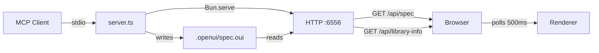
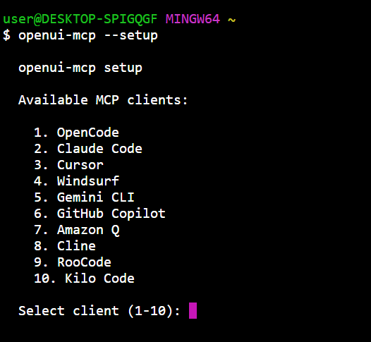

# OpenUI-MCP

MCP server for creating structured web UI through AI chat. Connects to any MCP client and renders OpenUI components live in a browser previewer.

**Cross-platform**: Linux, macOS, Windows.

## Architecture



The previewer dynamically loads the selected component library (via `/api/library-info`) and renders OpenUI Lang specs.

## Install & Update

### Linux / macOS

```bash
curl -fsSL https://raw.githubusercontent.com/naadodimtr/openui-mcp/main/install.sh | bash
```

### Windows (PowerShell)

```powershell
irm https://raw.githubusercontent.com/naadodimtr/openui-mcp/main/install.ps1 | iex
```

Installs a compiled binary to `~/.openui-mcp`, adds it to PATH, and runs `--setup` to configure your MCP client:



To update, either re-run the install script or:

```bash
openui-mcp --update
```

## MCP Tools

| Tool | Description |
|------|-------------|
| `get_system_prompt` | Returns the full system prompt for generating valid OpenUI Lang specs |
| `get_components` | Returns available component names, descriptions, and prop names |
| `update_spec` | Writes a spec to the previewer — triggers re-render in browser |
| `get_current_spec` | Reads the current spec being rendered |
| `get_preview_url` | Returns the previewer URL |
| `validate_spec` | Validates a spec without writing — returns parse errors, unresolved refs, orphaned statements |
| `list_libraries` | Lists available component library profile IDs, names, and descriptions |

`get_system_prompt`, `get_components`, and `validate_spec` accept an optional `libraryId` parameter.

## Library Plugins & Adapters

OpenUI MCP supports swappable component libraries through a runtime plugin system. The default library (`openui-default`) ships built-in. Additional libraries are installed as plugins.

### Cloudflare Kumo (Reference Adapter)

41 components from Cloudflare's design system, including Typography, Badges, Buttons, Cards, Callouts, Code, Tables, Meters, Forms, Tabs, Dialogs, Dropdowns, DatePicker, and more. Full variant coverage across all components.

```bash
# Install Kumo adapter
openui-mcp install-library github:naadodimtr/openui-kumo

# Or build and install locally
bun adapters/kumo/build.ts
openui-mcp install-library ./adapters/kumo/dist/

# Set as default for a project
openui-mcp init --library=kumo
```

### Creating Your Own Adapter

See [`adapters/ADAPTER_GUIDE.md`](adapters/ADAPTER_GUIDE.md) for a complete guide covering:

- The `openui-mcp-adapter.yaml` spec format
- Compound component patterns (Radio, Breadcrumbs, Dropdown, Dialog)
- Variant mapping and inline style fallbacks
- Unit and E2E testing blueprints
- Build pipeline and checksum security

```bash
openui-mcp build-adapter ./my-adapter.yaml --output ./dist/
openui-mcp install-library ./dist/
```

### Per-Project Config

Projects can set a default library via `.openui/config.json`:

```json
{ "library": "kumo" }
```

The server reads this on startup. The `libraryId` param on tool calls overrides it.

## CLI

| Command | Example | Description |
|---------|---------|-------------|
| `--port=N` | `openui-mcp --port=1234` | Override previewer HTTP port |
| `--setup` | `openui-mcp --setup` | Interactive MCP client configuration |
| `--update` | `openui-mcp --update` | Self-update to latest release |
| `--update <ver>` | `openui-mcp --update v1.0.0` | Update to a specific version |
| `--version` | `openui-mcp --version` | Print current version |
| `init` | `openui-mcp init --library=kumo` | Create `.openui/config.json` |
| `install-library` | `openui-mcp install-library ./dist/` | Install a library plugin |
| `update-library` | `openui-mcp update-library kumo` | Update a library plugin |
| `remove-library` | `openui-mcp remove-library kumo` | Remove a library plugin |
| `build-adapter` | `openui-mcp build-adapter ./adapter.yaml` | Build adapter bundle from spec |

## Environment Variables

| Variable | Default | Description |
|----------|---------|-------------|
| `OPENUI_SPEC_DIR` | `.openui` | Directory for spec files (relative to CWD or absolute) |
| `PREVIEWER_PORT` | `6556` | Port for the previewer + API |

## Testing

```bash
bun test                                       # 75 unit tests
bun test ./adapters/kumo/tests/renderer.test.ts  # 112 Kumo renderer tests
bunx playwright test                           # 34 E2E tests
bun run test:all                               # All three sequentially
```

## Development

```bash
bun install
cd previewer && bun install && bun run build && cd ..
bun src/server.ts   # MCP server + previewer on http://localhost:6556
```

For previewer hot-reload:

```bash
bun src/server.ts &                              # MCP server in background
cd previewer && PREVIEWER_PORT=6556 bun run dev  # Vite on :5173, proxies /api to :6556
```

## Building

```bash
bun run build   # Builds previewer, embeds assets, compiles binary
```

### Cross-Platform

```bash
bun build --compile src/server.ts --target=bun-linux-x64 --outfile dist/openui-mcp-linux
bun build --compile src/server.ts --target=bun-darwin-arm64 --outfile dist/openui-mcp-darwin
bun build --compile src/server.ts --target=bun-windows-x64 --outfile dist/openui-mcp.exe
```
