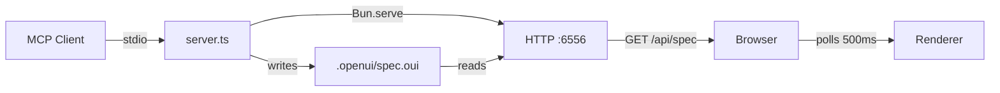

# OpenUI-MCP

MCP server for creating structured web UI through AI chat. Connects to any MCP client and renders OpenUI components live in a browser previewer.

**Cross-platform**: Linux, macOS, Windows.

## Architecture



## Install & Update

### Linux / macOS

```bash
curl -fsSL https://raw.githubusercontent.com/naadodimtr/openui-mcp/main/install.sh | bash
```

### Windows (PowerShell)

```powershell
irm https://raw.githubusercontent.com/naadodimtr/openui-mcp/main/install.ps1 | iex
```

Installs a compiled binary to `~/.openui-mcp`, adds it to PATH, and runs `--setup` to configure your MCP client:


To update, either re-run the install script or:

```bash
openui-mcp --update
```

## Tested MCP Clients

Works with any MCP client that supports stdio transport. Tested with:

| Client | Status |
|--------|--------|
| OpenCode | ✓ |
| Claude Code | ✓ |
| Cursor | ✗ |
| Windsurf | ✗ |
| Gemini CLI | ✗ |
| GitHub Copilot | ✗ |
| Codex | ✗ |
| Antigravity | ✗ |
| Crush | ✗ |

## MCP Tools

| Tool | Description |
|------|-------------|
| `get_system_prompt` | Returns the full system prompt for generating valid OpenUI Lang specs |
| `get_components` | Returns available component names, descriptions, and prop names |
| `update_spec` | Writes a spec to the previewer (triggers re-render in browser) |
| `get_current_spec` | Reads the current spec being rendered |
| `get_preview_url` | Returns the previewer URL |
| `validate_spec` | Validates a spec without writing — returns parse errors, unresolved refs, orphaned statements |
| `list_libraries` | Lists available component library profiles |

`get_system_prompt`, `get_components`, and `validate_spec` accept an optional `libraryId` parameter (default: `openui-default`).

## Library Plugins

OpenUI MCP supports swappable component libraries. The default library (`openui-default`) ships built-in. Additional libraries are installed as runtime plugins.

```bash
# Install a library adapter
openui-mcp install-library github:naadodimtr/openui-kumo

# Set project library
openui-mcp init --library=kumo

# List installed libraries
openui-mcp list-libraries
```

Plugins are stored in `~/.openui-mcp/libraries/`. See `adapters/ADAPTER_GUIDE.md` for creating your own adapter.

## CLI

| Command | Example | Description |
|---------|---------|-------------|
| `--port=N` | `openui-mcp --port=1234` | Override previewer HTTP port |
| `--setup` | `openui-mcp --setup` | Interactive MCP client configuration |
| `--update` | `openui-mcp --update` | Self-update to latest release |
| `--update <ver>` | `openui-mcp --update v1.0.0` | Update to a specific version |
| `--version` | `openui-mcp --version` | Print current version |
| `init` | `openui-mcp init --library=kumo` | Initialize project config (`.openui/config.json`) |
| `install-library` | `openui-mcp install-library github:org/repo` | Install a library plugin |
| `update-library` | `openui-mcp update-library kumo` | Update a library plugin |
| `remove-library` | `openui-mcp remove-library kumo` | Remove a library plugin |
| `build-adapter` | `openui-mcp build-adapter ./adapter.yaml` | Build adapter bundle from spec |

## Environment Variables

| Variable | Default | Description |
|----------|---------|-------------|
| `OPENUI_SPEC_DIR` | `.openui` | Directory for spec files (relative to CWD or absolute) |
| `PREVIEWER_PORT` | `6556` | Port for the previewer + API |

## Development

```bash
bun install
cd previewer && bun install && bun run build && cd ..
bun src/server.ts   # MCP server + previewer on http://localhost:6556
```

For previewer hot-reload:

```bash
bun src/server.ts &                          # MCP server in background
cd previewer && PREVIEWER_PORT=6556 bun run dev  # Vite on :5173, proxies /api to :6556
```

## Testing

```bash
bun test                # Unit + spec stress tests
bunx playwright test    # E2E browser tests
```

## Building

```bash
bun run build   # Builds previewer, embeds assets, compiles binary
```

### Cross-Platform

```bash
bun build --compile src/server.ts --target=bun-linux-x64 --outfile dist/openui-mcp-linux
bun build --compile src/server.ts --target=bun-darwin-arm64 --outfile dist/openui-mcp-darwin
bun build --compile src/server.ts --target=bun-windows-x64 --outfile dist/openui-mcp.exe
```
